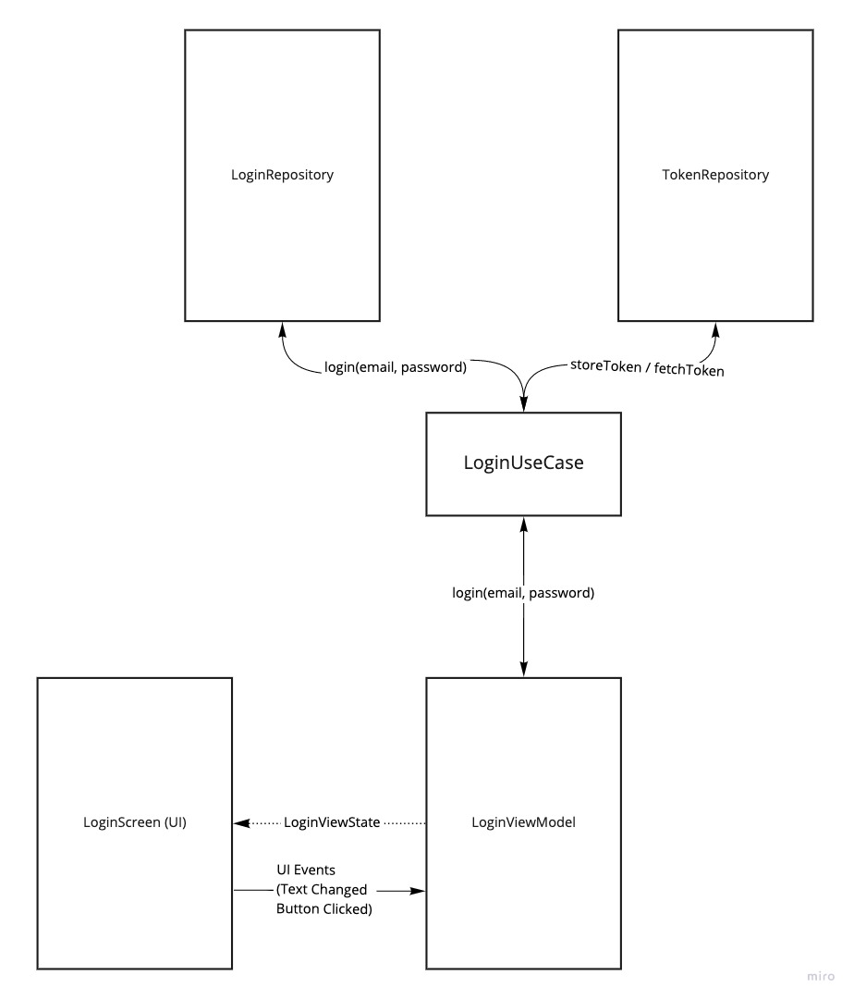

## App Architecture

This app follows a MVVM architecture pattern throughout the project. Below is the architecture 
diagram for the Login Screen, though every screen in the app should follow the same organization.

This document is intended to clarify each of types of components in the above image and their 
responsibilities.

## Repository

A repository is any component that is responsible for making data requests. This could be a remote server,
a local preference, database, etc. The only 